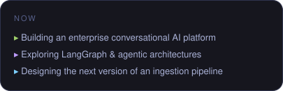
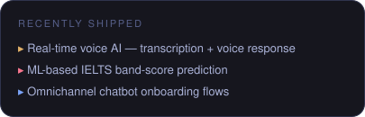
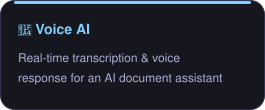
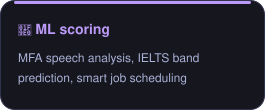
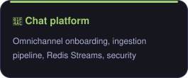
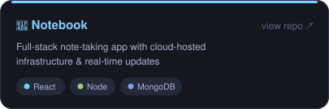
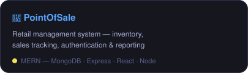
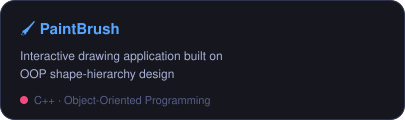
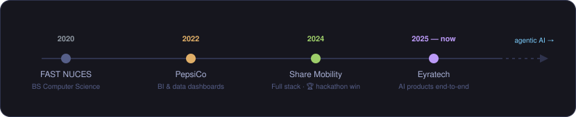
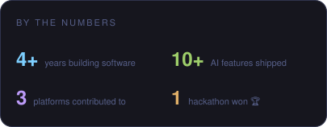

  

## 👋 About me

I'm a Software Engineer at **Eyratech**, where I build AI-powered products end-to-end — from conversational platforms and voice interfaces to machine-learning scoring systems. With a Computer Science foundation from **FAST NUCES**, I love turning complex technical problems into products people actually enjoy using.

- 🚀 **Full-stack expertise** — end-to-end apps across React, Angular, Node.js, Python & FastAPI
- 🤖 **AI/ML innovation** — custom ML models, NLP & speech processing in production
- 🔧 **System architecture** — scalable APIs, data pipelines, caching & messaging systems
- ⚙️ **DevOps mindset** — CI/CD automation, Docker, deployment reliability
- 👥 **Leadership** — mentoring junior engineers & interns, driving best practices

  
  

## 🛠️ Tech stack

  

**Also working with:** Express · REST APIs · Redis Streams · MinIO · Sequelize/SQLAlchemy · GitHub Actions · Matillion ETL · Power BI · Montreal Forced Alignment · OpenAI APIs · LangGraph

## 💼 Experience

  
  
  

**Software Engineer · Eyratech** — *Jun 2025 – present*

- Built omnichannel chatbot onboarding across **WhatsApp Cloud API, Messenger, Instagram & Web**, plus invitation flows, welcome messages, user profiling, and conversation-closure workflows
- Designed a **document ingestion pipeline** with intelligent parsing, indexing & deduplication, extended to WhatsApp integration
- Implemented **real-time voice communication** for an AI document assistant — live transcription and voice responses
- Developed an **IELTS speaking evaluation pipeline**: Montreal Forced Alignment speech analysis, structured examiner-style scoring, ML band-score prediction, and preemption-based job scheduling for efficient server utilization
- Strengthened platform security with **scoped & refresh tokens, API key management**, and MinIO asset management
- Improved performance & reliability via caching, advanced pagination, better logging, and messaging-pipeline enhancements with **Redis Streams**
- Built automation features — **escalation workflows with Slack integration** — and a prompt-testing tool for developers
- Set up **CI/CD with GitHub Actions**, drastically cutting frontend build failures; mentored a junior engineer and interns

**Software Engineer · Share Mobility** — *Jan 2024 – Jun 2025*

- Maintained and enhanced **React, Angular & Node.js** apps (admin panel, rider app) with MySQL/Sequelize
- Led an **OpenAI-powered CSV automation** project enabling bulk trip requests with natural-language modifications
- 🏆 **Won the company-wide hackathon** with two AI products — automated SQL reporting & an AI usage guide

**IT Intern · PepsiCo International** — *Jul – Aug 2022*

- Built interactive **Power BI dashboards** and performed data transformations for business insights

## 🎓 Education

**BS Computer Science · FAST NUCES Lahore** — *2020 – 2024*
CGPA 3.60/4.00 · Dean's List ×5 · Teaching Assistant, Database Systems ×2
*Core: Data Structures & Algorithms · Database Systems · Operating Systems · Software Engineering · OOP*

## 🚀 Featured projects

  
  
  

## 🧭 My journey

  

  

## 📜 Certifications & achievements

- 🏆 **Hackathon winner** — company-wide, two AI-powered products *(Oct 2024)*
- 📚 **Teaching Assistant** — Database Systems ×2, FAST NUCES
- 🎓 **Dean's List ×5** — Spring 2024 · Fall 2023 · Spring 2023 · Spring 2022 · Fall 2021

---

I'm always open to discussing new opportunities, innovative projects, or collaborations — **let's build something amazing together** 🚀

